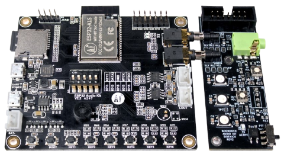

# Boondock TANGO / ECHO Hardware

- Assembled devices are available for purchase from [Ham Radio Outlet](https://www.hamradio.com)
- Development kits are available for purchase from [MakerFabs](https://www.makerfabs.com/boondock-echo-barebones-edition.html)
- Functional [ESP32-A1S Audiokit](https://www.google.com/search?q=esp32-a1s+audio+kit) development boards are available from Amazon, eBay, and AliExpress.
- 3D printable cases, PCB design files, and Sticker artwork are available in the [Boondock Hardware Repository](https://github.com/Boondock-Echo/Boondock-Hardware)

## Boondock ECHO


Complete Boondock Echo Assembly



Boondock Echo Development Board (ESP32-A1S + Sidekick)

## Boondock Tango


Complete Boondock Tango Assembly


Boondock Tango Development Board

# Boondock TANGO / ECHO Firmware

Firmware for [Boondock TANGO](https://boondockecho.com/product/tango) and [ECHO](https://boondockecho.com/product/echo) ESP32 audio devices. A single codebase builds two product variants that capture audio, create voice-activated WAV recordings, store or queue those recordings, and provide a device-hosted web interface for setup, monitoring, playback, and administration.

> ---
>
> ## `IMPORTANT`
>
> This project is a supplemental informational and hobby tool, **not** an
> emergency service, dispatch system, or life-safety system. Do not rely on it
> to protect people or property. Read [SAFETY.md](SAFETY.md) and the restrictions
> in [LICENSE.md](LICENSE.md) before building or using the firmware.
>
> ---

## Contents

- [What the firmware does](#what-the-firmware-does)
- [Firmware variants](#firmware-variants)
- [Hardware and software requirements](#hardware-and-software-requirements)
- [Firmware downloads and programming](#firmware-downloads-and-programming)
- [First-time setup](#first-time-setup)
- [Using the device](#using-the-device)
- [Configuration and interfaces](#configuration-and-interfaces)
- [Storage and upload behavior](#storage-and-upload-behavior)
- [Development workflow](#development-workflow)
- [Troubleshooting](#troubleshooting)
- [Documentation](#documentation)
- [License, safety, and contributions](#license-safety-and-contributions)

## What the firmware does

The firmware is designed for continuous, voice-activated audio capture:

1. It samples audio through the AudioKit/ES8388 input path.
2. When the measured level crosses the configured threshold, it starts a WAV
   recording and includes audio retained in the pre-record buffer.
3. Recording stops after the configured silence period or maximum duration.
4. With SD recording enabled, the file is queued under `/pending` and moved to
   `/inbox` after a successful upload. If SD storage is unavailable, the
   firmware can use a limited PSRAM-backed recording queue.
5. The embedded web application exposes device health, recorder controls, live
   audio, stored recordings, network settings, and administrative actions.

Additional capabilities include multiple Wi-Fi profiles, multiple upload
endpoints, retry and endpoint-health logic, NTP/RTC timekeeping, structured
serial telemetry, configurable logging, firmware updates, settings import and
export, and cloud settings synchronization.

For a component-level description, see
[docs/ARCHITECTURE.md](docs/ARCHITECTURE.md). Recorder and uploader flow charts
are available in [docs/recorder.md](docs/recorder.md) and
[docs/Uploader.md](docs/Uploader.md).

## Firmware variants

PlatformIO defines two build environments in [`platformio.ini`](platformio.ini):

| Environment | Build define | Intended product                                        | Variant-specific behavior                                                                                                                                                 |
| ----------- | ------------ | ------------------------------------------------------- | ------------------------------------------------------------------------------------------------------------------------------------------------------------------------- |
| `TANGO`     | `TANGO`      | [Boondock Tango](https://boondockecho.com/product/echo) | Configurable stereo record-input channel; SD recording is disabled by default until enabled in **Advanced**.                                                              |
| `ECHO`      | `ECHO`       | [Boondock Echo](https://boondockecho.com/product/tango) | ECHO speaker, LED/keypad, CW, and MQTT integration; SD recording is enabled by default. Enter the device's MQTT key in **Advanced** when MQTT service access is required. |

Both environments target `esp32dev`, use the Arduino framework, run the ESP32
at 160 MHz, expect PSRAM, use the `min_spiffs.csv` partition layout, and build
for AudioKit board configuration 5. Do not flash one product's image onto the
other product unless you understand the hardware and compile-time differences.

## Hardware and software requirements

### Hardware

- A compatible Boondock TANGO or ECHO device based on an ESP32 AudioKit/ES8388
  board configuration supported by this repository.
- A data-capable USB cable for flashing and serial monitoring.
- PSRAM (the build enables `BOARD_HAS_PSRAM`).
- An SD card if you want persistent local recording storage. The firmware can
  fall back to PSRAM, but that queue is intentionally limited and does not
  survive a reboot.
- A 2.4 GHz Wi-Fi network for device networking; ESP32 devices do not connect
  to 5 GHz-only networks.

### Software

- Visual Studio Code with the PlatformIO IDE extension when building or
  programming the firmware yourself.
- Python 3, used by the embedded-web-asset generation script.
- A supported USB-to-serial driver for your host and device.
- Git, if you are working from a clone of this repository.

## Firmware downloads and programming

Ready-to-flash compiled `.bin` firmware files are available on the
[GitHub Releases page](https://github.com/Boondock-Echo/Echo-Tango/releases).
Choose the binary for your device variant; TANGO and ECHO firmware are not
interchangeable.

To build or program an ESP32 from Visual Studio Code, follow PlatformIO's
official [PlatformIO IDE for VS Code quick-start guide](https://docs.platformio.org/en/latest/integration/ide/vscode.html#quick-start).
Open this repository as the PlatformIO project and select the environment that
matches your device (`TANGO` or `ECHO`).

## First-time setup

When the device has no usable saved Wi-Fi credentials, it starts its setup
access point.

1. Power on the device and wait for the access-point details in the serial log.
2. Join Wi-Fi network **`Boondock-AP`** using password **`boondockecho`**.
3. Open **<http://192.168.4.1>** in a browser. If the assigned AP address is
   different, use the `ACCESS Point IP` printed over serial.
4. Scan for networks or enter the SSID manually, supply the password, and test
   the connection.
5. Save the credentials and allow the device to reboot.

The setup form stores the credentials only after a successful connection test.
If setup fails, reconnect to `Boondock-AP`, confirm that the target network is
2.4 GHz, and re-enter the credentials.

## Using the device

### Open the web interface

After the device joins the same local network as your computer or phone, open:

```text
http://boondock.local
```

`boondock` is the default hostname. Change it under **Advanced → WiFi
Settings**, then use `http://<hostname>.local`. The hostname must contain only
lowercase letters, numbers, and interior hyphens.

mDNS `.local` discovery requires the client and device to share a network that
permits multicast traffic. If it does not resolve, find the IP address in the
serial output or router's DHCP client list and open `http://<device-ip>`.

### Main web pages

- **Home** — device, network, storage, queue, and recording summary.
- **Recorder** — audio-level display and trigger/recording settings.
- **Live Audio** — browser-based live monitoring and VU data.
- **Recordings** — browse and stream recordings stored on the SD card.
- **Network** — saved Wi-Fi profiles and network configuration.
- **Advanced** — SD card, upload locations, Wi-Fi power, settings transfer,
  firmware update, reboot, defaults, and factory reset.
- **Player & TX / CW** — ECHO-only pages. Some legacy transmit/repeater settings
  remain reserved for future behavior; consult the feature inventory before
  depending on them.

Browser playback and live audio are monitoring conveniences. Network load and
concurrent SD access can affect performance, so they should not be treated as
guaranteed or lossless streams.

## Configuration and interfaces

Settings are stored in ESP32 NVS as JSON-backed application configuration.
They can be managed through three interfaces:

### Web UI

The web UI is the recommended interface for routine setup. Changes that affect
hardware, storage, Wi-Fi, or endpoint behavior should be made deliberately and
verified after a reboot. Export a known-good settings file before making broad
changes. Exported files can contain operational configuration; treat them as
sensitive even where the firmware masks selected credential fields.

### Serial CLI

Connect at 115200 baud and enter `HELP` or `?`. Common commands include:

```text
STATUS                 Show device status
SHOW <parameter>       Read a setting
SET <parameter> <value>
SAVE                   Persist changed settings
EXPORT                 Print configuration JSON
REBOOT                 Restart the device
```

The CLI supports many additional commands for health, recordings, SD file
management, Wi-Fi reconnection, settings push/pull, and maintenance. Command
syntax, response JSON, parameter names, aliases, and validation rules are
documented in [docs/CLI.md](docs/CLI.md) and [docs/API.md](docs/API.md).

### HTTP API and WebSocket

The embedded application uses HTTP endpoints for device information, settings,
recordings, firmware operations, and the unified command interface. Live audio
and changing UI data use WebSocket connections. Integrators should start with:

- [docs/API.md](docs/API.md) — device HTTP and command API.
- [docs/BOONDOCK_API.md](docs/BOONDOCK_API.md) — cloud-facing requests.
- [docs/Events.md](docs/Events.md) — event payloads and delivery.
- [docs/SETTINGS.md](docs/SETTINGS.md) — settings JSON fields.

Do not expose the device web server directly to the public internet. The local
management interface is designed for use on a trusted network.

## Storage and upload behavior

### SD mode

- Active recordings are finalized as WAV files.
- Files awaiting upload live under `/pending/YYYY/MM/DD/`.
- After a successful upload, files move to `/inbox/YYYY/MM/DD/` and remain
  available to the recordings browser.
- Temporary or rejected artifacts may be moved under `/trash`.
- A small in-memory index prioritizes recent recordings; filesystem scans recover
  pending files not present in that index.

TANGO starts with SD use and SD recording disabled. Enable and test the card in
**Advanced** before expecting persistent recordings. ECHO starts with SD use and
recording enabled, but the card must still be compatible and correctly seated.

### PSRAM fallback

When SD recording is disabled or unavailable, recordings can be held in PSRAM
and queued for upload. This is a resilience mechanism, not persistent storage:
capacity is limited, recordings can be dropped when the queue is full, and all
queued data is lost on power failure or reboot.

### Cloud uploads

Cloud upload is endpoint-driven and requires working Wi-Fi, DNS/routing, and a
configured service. The firmware tracks endpoint health and retries failures.
Offline mode suppresses cloud uploads and events and is intended for local use
with SD storage. Review [docs/Uploader.md](docs/Uploader.md) and
[docs/SD_CARD_UPLOAD_RETRY_LOGIC.md](docs/SD_CARD_UPLOAD_RETRY_LOGIC.md) before
changing queue or retry behavior.

## Development workflow

### Embedded web application

The main browser application consists of embedded HTML/CSS plus JavaScript from
`src/app_spa.js`. The generated `src/app_js_spa_gz.h` embeds a deterministic
gzip copy of that JavaScript in the firmware.

Every PlatformIO build runs the generator automatically. To regenerate and
verify the header without compiling:

```bash
python3 scripts/generate_spa_gzip.py
git diff --check
```

Edit `src/app_spa.js`, **not** the generated byte array. Commit the generated
header with the source change.

### Suggested validation

For changes shared by both products, build both environments:

```bash
pio run -e TANGO
pio run -e ECHO
```

Hardware-affecting changes should also be tested on the matching device. At a
minimum, verify boot, Wi-Fi setup/reconnection, the web UI, audio triggering,
recording finalization, and the intended storage/upload mode. A successful
compile alone does not validate codec, SD, PSRAM, radio, or network behavior.

### Repository layout

```text
platformio.ini        PlatformIO environments, flags, and dependencies
src/                  Firmware and embedded web application
scripts/              Build-time asset generation
lib/                  Vendored embedded libraries
docs/                 Architecture, APIs, operations, and engineering notes
```

## Troubleshooting

### Upload cannot connect to the board

- Confirm the cable supports data, not power only.
- Run `pio device list` and specify `--upload-port` if necessary.
- Close other serial monitors before uploading.
- Reset the device or use its boot/reset controls if the USB bridge does not
  automatically enter the bootloader.

### `boondock.local` does not open

- Confirm the browser and device are on the same LAN/VLAN.
- Try the IP printed over serial or shown in the router's DHCP table.
- Check whether the network blocks multicast/mDNS or client-to-client traffic.
- Confirm the hostname in **Advanced → WiFi Settings** if it was changed.

### Device returns to setup AP

Saved credentials may be absent or unusable. Rejoin `Boondock-AP`, verify the
2.4 GHz SSID/password, and check signal strength. Enterprise/captive-portal
networks may require authentication flows the setup form does not provide.

### Recordings are not retained

- On TANGO, enable both SD use and recording in **Advanced**.
- Run the web UI SD-card test and confirm the card mounts successfully.
- Remember that PSRAM recordings disappear on reboot.
- Inspect the 115200-baud serial log for codec, write, queue, and upload errors.

### Recordings do not upload

- Confirm the device has an IP address and internet/API reachability.
- Verify the upload endpoint is enabled and correctly configured.
- Review `/pending` state, endpoint health, and recent errors in the UI or CLI.
- ECHO MQTT configuration is separate from HTTP audio upload configuration.

## Documentation

| Document                                   | Purpose                                            |
| ------------------------------------------ | -------------------------------------------------- |
| [Architecture](docs/ARCHITECTURE.md)       | Components, tasks, and data flow                   |
| [Application startup](docs/Application.md) | Boot and FreeRTOS task sequence                    |
| [Recorder](docs/recorder.md)               | Detection, recording, and live-audio flow          |
| [Uploader](docs/Uploader.md)               | Queues, storage lifecycle, and uploads             |
| [Device API](docs/API.md)                  | Local HTTP API, command API, and parameters        |
| [Serial CLI](docs/CLI.md)                  | Commands and serial response formats               |
| [Settings](docs/SETTINGS.md)               | Configuration JSON reference                       |
| [Cloud API](docs/BOONDOCK_API.md)          | Audio, event, log, firmware, and settings requests |
| [Serial telemetry](docs/SERIAL_STATUS.md)  | Automated serial message types                     |
| [ECHO feature inventory](ECHO-2024.md)     | Current-versus-legacy feature comparison           |

Some files in `docs/` are engineering analyses, recommendations, or historical
release notes rather than a promise of current behavior. For implementation
truth, compare them with the current source and `platformio.ini`.

## License, safety, and contributions

This repository is **source-available, not OSI open source**. The draft
[Boondock Personal and Non-Commercial Source License](LICENSE.md) permits the
uses described there and prohibits commercial and safety-critical use.
Commercial use requires a separate written agreement; see
[COMMERCIAL-LICENSE.md](COMMERCIAL-LICENSE.md).

Read [SAFETY.md](SAFETY.md) before use. Missed, delayed, incomplete, or corrupted
audio and data are possible, as are hardware, network, storage, cloud-service,
and software failures.

Public contributions are currently disabled until the contributor agreement
process is finalized. Do not open a contribution without first reading
[CONTRIBUTING.md](CONTRIBUTING.md).

Copyright © 2026 Boondock Technologies, LLC. All rights reserved.
