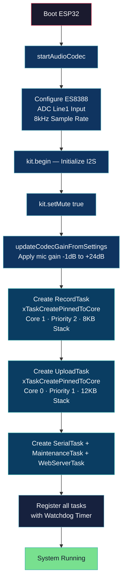
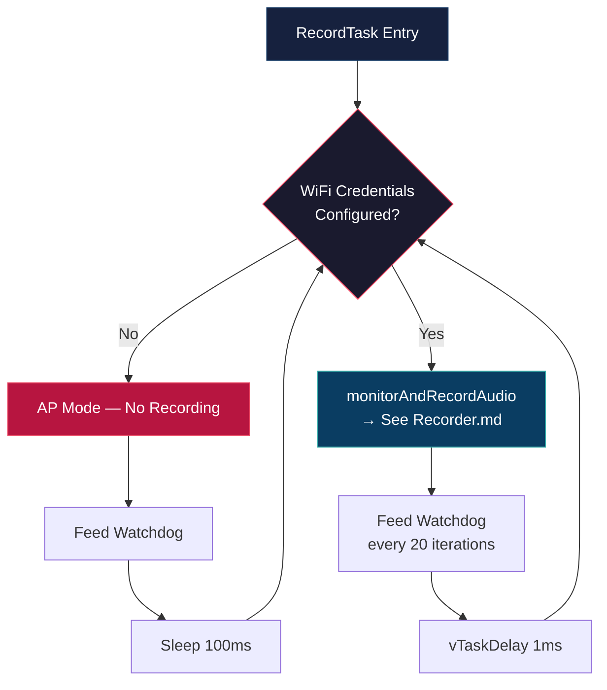

# Application — System Startup & Task Architecture

## Overview

The application is an ESP32-based audio capture system running on FreeRTOS with two cores. On boot it initializes the ES8388 audio codec, creates all FreeRTOS tasks, and registers them with the watchdog timer. The system supports two storage modes: **SD card** (persistent files) and **PSRAM** (in-memory buffer).

| Task | Core | Priority | Stack | Role |
|------|------|----------|-------|------|
| RecordTask | 1 | 2 | 8 KB | Audio I/O and recording — see [Recorder.md](Recorder.md) |
| UploadTask | 0 | 1 | 12 KB | File uploads to API — see [Uploader.md](Uploader.md) |
| SerialTask | 0 | 3 | 8 KB | CLI and serial communication |
| MaintenanceTask | 0 | 1 | 8 KB | Health checks, cleanup, summaries |
| WebServerTask | 0 | 2 | 8 KB | Web UI and WebSocket events |

---

## Chart 1 — System Startup & Task Creation

---

## Chart 2 — RecordTask Main Loop

The RecordTask is the entry point into the recording pipeline. It gates on WiFi credentials — when none are configured (AP mode), the task idles and feeds the watchdog. Once credentials exist, it calls `monitorAndRecordAudio()` on every iteration (see [Recorder.md](Recorder.md) for that flow).

---

## Default Audio Settings

| Setting | Default | Purpose |
|---------|---------|---------|
| Sample rate | 8000 Hz | Low bandwidth mono voice capture |
| Threshold | 50 (maps to -40 dB) | Sound detection sensitivity |
| Pre-record | 200 ms | Captures audio before trigger |
| Min recording | 1000 ms | Prevents ultra-short clips |
| Max recording | 30000 ms | Hard recording length cap |
| Silence threshold | 1000 ms | How long silence before stopping |
| Codec gain | 0 dB | ES8388 mic amplification |
| dB smoothing | 20-sample window | Noise-resistant threshold detection |
