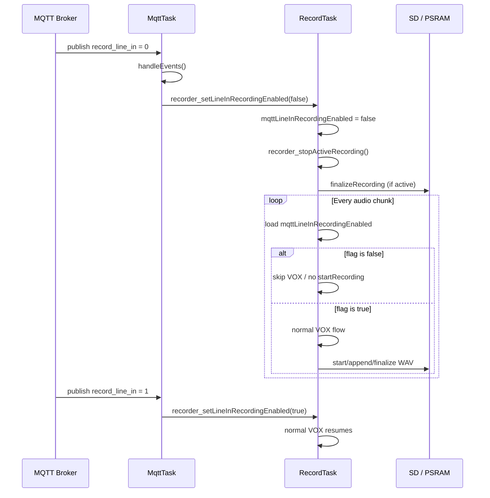
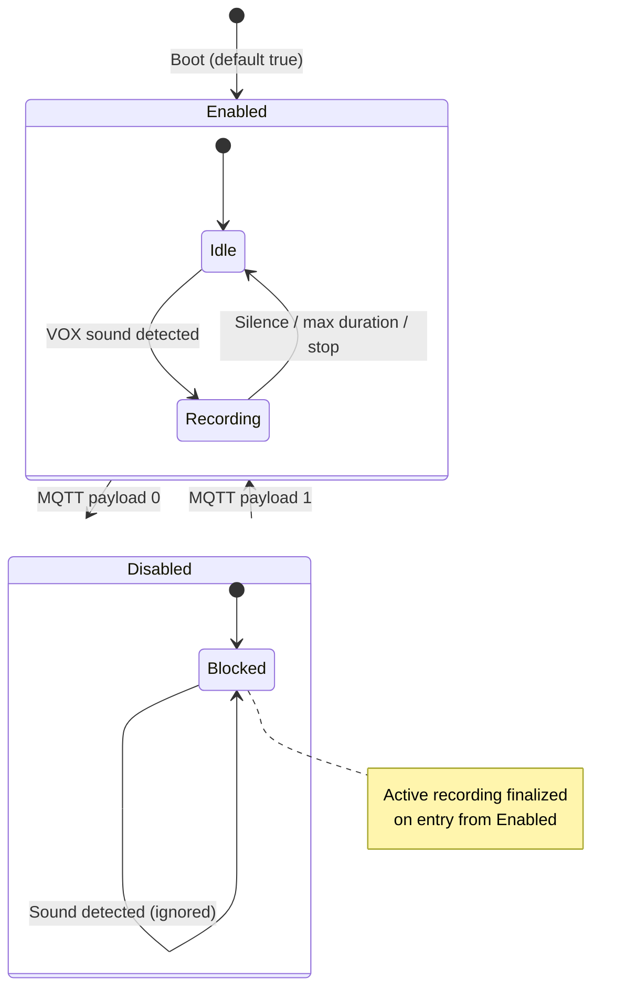

# MQTT `record_line_in` — Remote Line-In Recording Control

## Overview

The ECHO firmware exposes an MQTT command that remotely enables or disables automatic line-in recording (VOX-based WAV capture). This lets a backend or operator stop recording on a device without physical access, and re-enable it later.

| Payload | Behavior |
|---------|----------|
| `1` | **Enable** line-in VOX recording (normal automatic capture resumes) |
| `0` | **Disable** recording: any active session is stopped immediately, and **no new recordings** start until `1` is received |

**Default at boot:** recording is **enabled** (`mqttLineInRecordingEnabled = true`). Devices that never receive this MQTT command behave as before.

**Build scope:** This feature is compiled only when `ECHO` is defined (`#if defined(ECHO)` in the recorder loop). MQTT handling lives entirely in `src/mqtt_task.cpp`, which is also ECHO-only.

---

## MQTT Topic Format

On connect, the device subscribes to:

```
boondock/<device_id>/set/#
boondock/<lowercase_device_id>/set/#
```

To control recording, publish to:

```
boondock/<device_id>/set/record_line_in
```

| Field | Description |
|-------|-------------|
| `<device_id>` | 12-character MAC-based device ID (same as `getDeviceId()`) |
| Payload | Exactly `0` or `1` (case-insensitive after trim; other values are ignored) |
| QoS | Subscription uses `MQTT_EVENT_QOS` (1) from `config.h` |

### Example publishes

**Stop recording until re-enabled:**

```
Topic:   boondock/AABBCCDDEEFF/set/record_line_in
Payload: 0
```

**Re-enable recording:**

```
Topic:   boondock/AABBCCDDEEFF/set/record_line_in
Payload: 1
```

Broker host/port/credentials are defined in `src/config.h` (`ECHO_MQTT_BROKER_HOST`, etc.).

---

## Architecture

Two FreeRTOS tasks cooperate:

| Task | File | Role |
|------|------|------|
| **MqttTask** | `src/mqtt_task.cpp` | Receives MQTT messages, parses topic, calls `handleEvents()` |
| **RecordTask** | `src/recorder.cpp` | Reads I2S audio, runs VOX detection, starts/stops WAV files |

They communicate through a single **thread-safe atomic flag**: `mqttLineInRecordingEnabled`.



---

## Source Files

| File | What it contains |
|------|------------------|
| `src/mqtt_task.cpp` | MQTT subscribe, message parsing, `record_line_in` command handler |
| `src/recorder.cpp` | Flag storage, setter/getter, RecordTask gate, sample-recording block |
| `src/recorder.h` | Public API declarations |

---

## Code Reference

### 1. Public API (`recorder.h`)

```cpp
// MQTT record_line_in: 1 = allow line-in VOX recording; 0 = stop and block new recordings until 1.
void recorder_setLineInRecordingEnabled(bool enabled);
bool recorder_isLineInRecordingEnabled();
```

- **`recorder_setLineInRecordingEnabled(bool)`** — Called from MQTT task when payload is `0` or `1`.
- **`recorder_isLineInRecordingEnabled()`** — Returns current flag; can be used by other modules for UI/status.

---

### 2. Internal state (`recorder.cpp`)

```cpp
std::atomic<bool> mqttLineInRecordingEnabled{true};
```

- `std::atomic` ensures safe reads/writes between **MqttTask** and **RecordTask** without a mutex.
- Default `{true}` keeps recording allowed at boot until an explicit `0` is received.

---

### 3. MQTT subscription (`mqtt_task.cpp`)

On broker connect:

```cpp
void onMqttConnect(bool sessionPresent)
{
    const String subMac = String("boondock/") + device_id + "/set/#";
    mqttClient.subscribe(subMac.c_str(), MQTT_EVENT_QOS);

    String lowerDeviceId = String(device_id);
    lowerDeviceId.toLowerCase();
    const String subMacLower = String("boondock/") + lowerDeviceId + "/set/#";
    mqttClient.subscribe(subMacLower.c_str(), MQTT_EVENT_QOS);
}
```

---

### 4. Message routing (`mqtt_task.cpp`)

Incoming messages are cleaned, the command name is extracted after `/set/`, and `handleEvents()` is invoked:

```cpp
void onMqttMessage(char *topic, char *payload, ...)
{
    // ... build cleanedTopic and value from payload ...

    const int setIdx = cleanedTopic.indexOf("/set/");
    if (setIdx < 0)
        return;

    String cmd = cleanedTopic.substring(setIdx + 5);  // e.g. "record_line_in"
    cmd.trim();
    cmd.toLowerCase();

    if (g_commandInProgress) {
        logWarnf("[MQTT] Following command is discarded: cmd=%s value=%s", ...);
        return;
    }

    g_commandInProgress = true;
    if (!handleEvents(cmd, value))
        g_commandInProgress = false;
}
```

For `record_line_in`, `handleEvents` returns `false` immediately so the command slot is freed (unlike `play_cloud`, which keeps the slot busy until playback finishes).

---

### 5. Command handler (`mqtt_task.cpp`)

```cpp
if (cmd == "record_line_in")
{
    String v = value;
    v.trim();
    v.toLowerCase();
    if (v == "0")
    {
        recorder_setLineInRecordingEnabled(false);
        logWarnf("[MQTT] record_line_in=0: recording stopped until value=1");
        return false;
    }
    if (v == "1")
    {
        recorder_setLineInRecordingEnabled(true);
        logWarnf("[MQTT] record_line_in=1: recording enabled");
        return false;
    }
    logWarnf("[MQTT] ignored record_line_in invalid value='%s'", v.c_str());
    return false;
}
```

**Notes:**

- Only `"0"` and `"1"` are accepted after trim/lowercase.
- Invalid payloads are logged and ignored; the previous flag value is unchanged.

---

### 6. Setter — flag update and immediate stop (`recorder.cpp`)

```cpp
void recorder_setLineInRecordingEnabled(bool enabled)
{
    const bool wasEnabled = mqttLineInRecordingEnabled.exchange(enabled, std::memory_order_relaxed);
    if (wasEnabled == enabled)
        return;

    logWarnf("[Record] MQTT record_line_in -> %s", enabled ? "enabled" : "disabled");
    if (!enabled)
        recorder_stopActiveRecording("mqtt_record_line_in");
}

bool recorder_isLineInRecordingEnabled()
{
    return mqttLineInRecordingEnabled.load(std::memory_order_relaxed);
}
```

When disabling:

1. `exchange()` atomically sets the new value and returns the old one.
2. Duplicate commands (same value twice) are no-ops.
3. `recorder_stopActiveRecording()` finalizes any in-progress WAV immediately.

`recorder_stopActiveRecording` implementation:

```cpp
void recorder_stopActiveRecording(const char *reason)
{
    if (!reason)
        reason = "manual";
    if (!isRecording)
        return;
    finalizeRecording(false, reason);
}
```

`finalizeRecording(false, ...)` closes the file without treating the clip as a successful upload candidate (same pattern as live-audio pause).

---

### 7. RecordTask gate — blocks ongoing and future VOX recording (`recorder.cpp`)

Inside `monitorAndRecordAudio()`, after live-audio pause handling and **before** VOX `startRecording()` logic:

```cpp
#if defined(ECHO)
        if (!mqttLineInRecordingEnabled.load(std::memory_order_relaxed))
        {
            if (isRecording)
            {
                finalizeRecording(false, "mqtt_record_line_in");
                if (appSettings.repeaterEnabled && appSettings.repeaterMode == 2)
                    setPttOut(false);
            }
            pushPreRecordSamples(recordingBuffer, monoSamples);
            return;
        }
#endif
```

**What this does on every audio chunk (~tens of ms):**

| Condition | Action |
|-----------|--------|
| Flag `false`, recording active | `finalizeRecording(false, "mqtt_record_line_in")`, release PTT if duplex repeater TX mode |
| Flag `false`, idle | Skip sound detection and `startRecording()` |
| Either | Still update pre-record ring buffer (`pushPreRecordSamples`) so a quick re-enable with `1` does not miss audio onset |
| Either | `return` — normal VOX path below is not executed |

This is the same structural pattern as `recordingPausedForLiveSession` (browser live-audio UX).

---

### 8. Sample recording block (`recorder.cpp`)

Manual/sample capture (e.g. web UI SAMPLE command) is also gated:

```cpp
bool recorder_startSampleRecording()
{
#if defined(ECHO)
    if (!mqttLineInRecordingEnabled.load(std::memory_order_relaxed))
        return false;
#endif
    // ... existing sample recording logic ...
}
```

---

## State Machine



---

## Logging

Expected serial/log output:

| Event | Log line |
|-------|----------|
| Message received | `[MQTT] RX topic=... cmd=record_line_in value=0` |
| Disable applied | `[MQTT] record_line_in=0: recording stopped until value=1` |
| Enable applied | `[MQTT] record_line_in=1: recording enabled` |
| Recorder flag change | `[Record] MQTT record_line_in -> disabled` or `-> enabled` |
| Invalid payload | `[MQTT] ignored record_line_in invalid value='...'` |
| Active file closed | Finalize reason string: `mqtt_record_line_in` |

---

## What Is *Not* Affected

When `record_line_in = 0`:

| Still works | Blocked |
|-------------|---------|
| I2S capture / codec read | Automatic VOX WAV recording |
| Live audio WebSocket stream (if enabled) | `recorder_startSampleRecording()` |
| Speaker / line-out monitoring | New `startRecording()` from VOX |
| MQTT `play_cloud` / `play_transmit` | |
| Upload queue for already-finished files | |

Recording pause from the web UI (`recorder_setRecordingPausedForLiveSession`) is a **separate** flag and can stack conceptually with this MQTT flag (both must allow recording for VOX to run).

---

## Thread Safety

| Mechanism | Purpose |
|-----------|------|
| `std::atomic<bool> mqttLineInRecordingEnabled` | Lock-free flag between MqttTask and RecordTask |
| `memory_order_relaxed` | Sufficient here: only a boolean gate, no ordering with other atomics required |
| RecordTask owns `isRecording` / file handles | Ongoing stop is reliably handled in the audio loop; `recorder_stopActiveRecording` from MQTT provides best-effort immediate stop |

---

## Troubleshooting

| Symptom | Likely cause |
|---------|----------------|
| Command ignored | Topic missing `/set/` segment, or `g_commandInProgress` true (another long command running) |
| Recording continues after `0` | Firmware without RecordTask gate (older build); reflash with current `recorder.cpp` |
| No effect at boot until `1` | If default were changed to `false`; current default is `true` |
| Invalid value in logs | Payload not exactly `0` or `1` (e.g. `true`, `off`, JSON) |
| MAC case mismatch | Device subscribes to both upper and lower case device ID topics |

---

## Related Documentation

- [recorder.md](recorder.md) — VOX detection, pre-record buffer, PSRAM/SD paths
- [Application.md](Application.md) — RecordTask and MqttTask overview
- [ARCHITECTURE.md](ARCHITECTURE.md) — System-level task layout

---

## Quick Test Checklist

1. Device online, MQTT connected (`[MQTT] CONNECTED` in log).
2. Publish `record_line_in = 1` (optional; default is already enabled).
3. Trigger audio above threshold → recording starts (RADIO LED solid red on ECHO).
4. Publish `record_line_in = 0` → active recording stops, no new recordings on further audio.
5. Publish `record_line_in = 1` → VOX recording resumes on next sound event.
