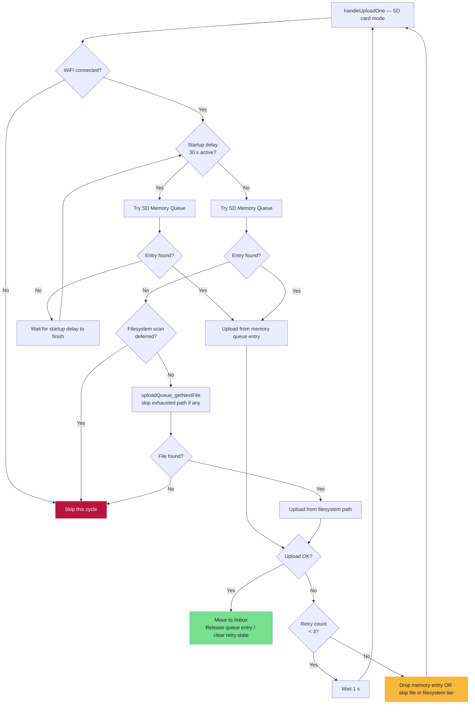

# SD Card Mode — Upload Retry Logic

This document explains how the firmware handles upload failures in **SD card storage mode**, including what changed when bounded retry logic was added (commit `0db4e84`, June 2026).

**Primary source files:**
- `src/networkHandller.cpp` — upload task orchestration and retry decisions
- `src/upload_queue.h` / `src/upload_queue.cpp` — queue structures and filesystem scan
- `src/recorder.cpp` — enqueues new recordings into the SD memory queue after finalize

---

## Overview

In SD card mode, completed recordings live on disk under `/pending/YYYY/MM/DD/*.wav`. The upload task (`NetworkTask` on Core 0) drains them through **two tiers**:

| Tier | Name | What it is | When used |
|------|------|------------|-----------|
| **1** | SD Memory Queue | SPIRAM-backed list of basenames (up to 50 entries) | Immediately after recording; also during the 30 s startup window |
| **2** | Filesystem fallback | Full scan of `/pending` for the **newest** `.wav` | After startup delay, when the memory queue is empty |

Both tiers call the same HTTP upload path (`uploadAudioFile`). Retry behavior differs slightly between them, but both now share the same limits.

### Shared constants

| Constant | Value | Meaning |
|----------|-------|---------|
| `kUploadMaxRetries` | **3** | Max consecutive upload failures before giving up on the current queue entry / file attempt |
| `kRetryDelayMs` | **1000 ms** | Delay after a failed upload before the upload task tries again |
| `kStartupDelayMs` | **30 000 ms** | After boot, only the memory queue is serviced; filesystem scan is deferred |
| `kFsFallbackEmptyScanMinIntervalMs` | **5000 ms** | Minimum interval between filesystem scans when `/pending` appears empty |

---

## SD Card Upload Flow (Current)



---

## Tier 1 — SD Memory Queue Retry Logic

### How entries get into the queue

When a recording finishes in SD mode, `recorder.cpp` renames `.tmp → .wav` and calls:

```cpp
sdCardMemoryQueue_addRecording(finishedRecordingPath, recordedEpoch, recordedMs);
```

Each `SdCardMemoryQueueEntry` stores:
- `basename` — e.g. `2026-06-19-14-30-45.wav`
- `recordedAtEpoch` / `recordedAtMs` — used for oldest-first ordering
- `uploadRetryCount` — **consecutive upload failures** for this entry (added in June 2026)
- `inUse` — slot occupancy flag

The upload task resolves the full path via `sdCardMemoryQueue_buildFullPath()` → `/pending/YYYY/MM/DD/<basename>`.

### On each upload attempt (`uploadTask_trySdCardMemoryQueueOne`)

1. Pick the **oldest** in-use entry (`sdCardMemoryQueue_getNextEntry`).
2. Open the WAV on SD, build an `UploadRequest`, call `uploadAudioFile`.
3. **Success:**
   - Move file to `/inbox` via `uploadQueue_markUploaded`.
   - Reset `uploadRetryCount = 0`.
   - Release the memory queue slot (`sdCardMemoryQueue_releaseEntry`).
4. **Failure:**
   - Increment `recorder` error count.
   - Increment `memEntry->uploadRetryCount`.
   - If `uploadRetryCount >= kUploadMaxRetries` (**3**):
     - **Drop the memory queue entry** — slot is freed.
     - **The WAV file stays on SD** in `/pending` (not deleted).
     - Log: `SD memory queue upload failed N consecutive times, dropping queue entry (file remains on SD)`.
   - Else (`uploadRetryCount` is 1 or 2):
     - Keep the entry in the queue.
     - Log once per path: `Memory queue upload failed (will retry N/3)`.
     - Wait `kRetryDelayMs` (1 s).
     - Next cycle retries the same entry (still the oldest).

### Immediate release (no retry counter)

These cases **do not** increment `uploadRetryCount`; the entry is released immediately:

| Condition | Behavior |
|-----------|----------|
| Invalid basename (cannot build full path) | Release entry, log warning |
| File open failed on SD | Release entry, log error |

The file may still exist on disk and can be picked up later by the filesystem fallback tier.

### After max retries — what happens to the file?

The memory queue **forgets** the file, but the WAV **remains on the SD card** under `/pending`. Once the memory queue is empty (and startup delay has passed), the filesystem fallback tier can discover and upload it — starting a **fresh** retry cycle with its own `fsFallbackRetryCount`.

---

## Tier 2 — Filesystem Fallback Retry Logic

### When it runs

Filesystem scan runs only when:
- Storage mode is SD card
- The 30 s startup delay has completed
- The SD memory queue is **empty**
- No deferred-scan backoff is active
- Recording is **not** in progress and no upload is marked busy (scan is deferred otherwise)

`uploadQueue_getNextFile(skipFullPath)` walks `/pending` recursively and returns the **lexicographically newest** `.wav` (timestamp-based filenames make this equivalent to most recent recording).

### Retry state (static, in `handleUploadOne`)

| Variable | Purpose |
|----------|---------|
| `fsFallbackRetryPath` | Full path of the file currently being retried |
| `fsFallbackRetryCount` | Consecutive failures for that path |
| `lastWarnedFilePath` | Log deduplication — avoid spamming the same warning every second |

### On upload failure

1. Track the failed path in `fsFallbackRetryPath`.
2. Increment `fsFallbackRetryCount` if the path matches the previous failure; otherwise reset to 1.
3. If `fsFallbackRetryCount >= kUploadMaxRetries` (**3**):
   - Log: `SD filesystem upload failed N consecutive times, skipping file for now`.
   - Reset `fsFallbackRetryCount` to 0.
   - **Keep** `fsFallbackRetryPath` set so the next scan passes it as `skipFullPath`.
   - The file **stays in `/pending`** — it is not deleted or moved to trash.
4. Else (`fsFallbackRetryCount` is 1 or 2):
   - Log: `Upload failed (will retry N/3)`.
   - Wait 1 s, then retry the same file on the next cycle.
5. After success: clear both `fsFallbackRetryPath` and `fsFallbackRetryCount`.

### Skipping to another file after exhaustion

When retries are exhausted, the handler calls:

```cpp
uploadQueue_getNextFile(fsFallbackRetryPath);  // skip the bad file
```

The intent is to pick the **next-newest** pending file so one persistently failing upload does not block the entire queue.

If no alternate file exists:
- Log: `No alternate pending file after skipping exhausted retries`.
- Clear skip state.
- Back off filesystem scans for 5 s.

> **Note:** `uploadQueue_getNextFile(const char* skipFullPath)` is declared in `upload_queue.h` with the skip parameter. The `.cpp` implementation must honor `skipFullPath` when excluding an exhausted file from the newest-file selection. If the skip logic is not yet wired in the scan helper, the filesystem tier may keep re-selecting the same newest file after count reset — verify the implementation matches the handler’s intent.

---

## Example — File Fails 3 Times in SD Card Mode

### Scenario A — Failure while in memory queue

```
Recording completes → enqueued in SD memory queue
Attempt 1: HTTP upload fails → uploadRetryCount = 1, wait 1 s
Attempt 2: HTTP upload fails → uploadRetryCount = 2, wait 1 s
Attempt 3: HTTP upload fails → uploadRetryCount = 3 → DROP memory entry
           File still on SD: /pending/2026/06/19/2026-06-19-10-00-00.wav

Later (memory queue empty, startup delay done):
Filesystem scan finds the same file → new fsFallbackRetryCount cycle (1…3)
```

### Scenario B — Failure via filesystem fallback only

```
Boot with orphaned files in /pending, memory queue empty
Filesystem picks newest: /pending/.../2026-06-19-09-00-00.wav
Attempt 1–2: fail → fsFallbackRetryCount = 1, 2
Attempt 3: fail → skip this file, try next newest in /pending
If upload succeeds on another file → exhausted file remains for a future scan cycle
```

### Scenario C — Network recovers mid-retry

```
Attempt 1: fail → uploadRetryCount = 1
Attempt 2: success → file moved to /inbox, uploadRetryCount reset, entry released
```

---

## Previous Behavior (Before June 2026)

Commit history for context:

| Commit | Date | Change |
|--------|------|--------|
| `fc7d196` | May 2026 | Added 1 s retry delay after any upload failure |
| `33582bc` | May 2026 | Added max **3** retries for **PSRAM mode only** — drop entry after exhaustion |
| `0db4e84` | Jun 2026 | Extended bounded retry logic to **SD card mode** (memory queue + filesystem) |

### SD Memory Queue — **before**

| Aspect | Previous | Current |
|--------|----------|---------|
| Retry limit | **None** — retried forever | **3** consecutive failures, then drop entry |
| Per-entry counter | Not tracked | `SdCardMemoryQueueEntry::uploadRetryCount` |
| On exhaustion | Entry never removed; blocked the queue head indefinitely | Entry removed; file kept on SD for filesystem tier |
| Log message | `Memory queue upload failed: <path> (will retry)` | `Memory queue upload failed (will retry N/3)` or drop message |
| Delay after failure | 1 s | 1 s (unchanged) |

### Filesystem Fallback — **before**

| Aspect | Previous | Current |
|--------|----------|---------|
| Retry limit | **None** — same newest file retried forever | **3** failures, then skip to another file |
| Per-file counter | Not tracked | `fsFallbackRetryCount` + `fsFallbackRetryPath` |
| Skip alternate files | No | Yes — via `uploadQueue_getNextFile(skipFullPath)` |
| Log message | `Upload failed: <path> (will retry)` | `Upload failed (will retry N/3)` or skip message |
| File on exhaustion | Stayed in `/pending`, retried every cycle | Still stays in `/pending`; temporarily skipped so other files can upload |

### PSRAM Mode — **unchanged in June commit**

PSRAM already had 3-strike drop logic since `33582bc`. The June commit renamed `kPsramUploadMaxRetries` → `kUploadMaxRetries` so SD and PSRAM share one constant. PSRAM still **drops the in-memory buffer** on exhaustion (data loss). SD mode **never deletes the WAV** on retry exhaustion — only the in-memory tracking is cleared or skipped.

---

## Design Rationale

### Why cap retries?

Without a limit, a single bad file (corrupt WAV, permanent server rejection, unopenable path cached in queue) could sit at the head of the memory queue and **starve all newer recordings** from uploading.

### Why keep the file on SD after dropping the memory entry?

SD storage is the source of truth. Dropping the queue slot frees RAM and unblocks newer entries, while preserving the recording for a later filesystem pass — for example after WiFi returns or a server outage clears.

### Why skip (not delete) after filesystem exhaustion?

Same principle: a persistently failing file should not block the rest of the backlog. Skipping allows the device to drain other pending uploads. The skipped file remains in `/pending` for a future attempt (next boot, later scan cycle, or manual recovery).

### Why 1 s delay?

Prevents hammering the server and WiFi stack on rapid consecutive failures. Introduced in `fc7d196`.

### Why 3 attempts?

Matches the PSRAM policy for consistent behavior across storage modes — enough tolerance for transient network blips without infinite blocking.

---

## Logging Reference

| Log | Meaning |
|-----|---------|
| `[UploadTask] Memory queue upload failed (will retry 1/3): <path>` | SD memory queue tier; retries remaining |
| `[UploadTask] SD memory queue upload failed 3 consecutive times, dropping queue entry: <path> (file remains on SD)` | Memory queue exhausted; file still on disk |
| `[UploadTask] Upload failed (will retry 2/3): <path>` | Filesystem tier; retries remaining |
| `[UploadTask] SD filesystem upload failed 3 consecutive times, skipping file for now: <path>` | Filesystem tier exhausted; will try other files |
| `[UploadTask] No alternate pending file after skipping exhausted retries: <path>` | Only one pending file and it is exhausted |
| `[UploadTask] upload failed reason=<reason> path=<path>` | Emitted on every failure (from `network_getLastUploadFailureReason()`) |

Warning logs for a given path are deduplicated via `lastWarnedFilePath` so the serial log is not flooded on every 1 s retry.

---

## Related Structures

```cpp
// upload_queue.h — SD memory queue entry
struct SdCardMemoryQueueEntry {
    char basename[64];
    time_t recordedAtEpoch;
    unsigned long recordedAtMs;
    bool inUse;
    uint8_t uploadRetryCount;  // consecutive upload failures (added Jun 2026)
};
```

```cpp
// networkHandller.cpp — filesystem fallback retry state (function-static)
static char fsFallbackRetryPath[kMaxUploadPathLength];
static uint8_t fsFallbackRetryCount;
constexpr uint8_t kUploadMaxRetries = 3;
constexpr uint32_t kRetryDelayMs = 1000;
```

---

## Summary

| Mode / Tier | Max retries | On exhaustion | File data |
|-------------|-------------|---------------|-----------|
| PSRAM queue | 3 | Drop PSRAM entry (buffer freed) | **Lost** (RAM-only) |
| SD memory queue | 3 | Drop SPIRAM queue entry | **Kept** on SD in `/pending` |
| SD filesystem fallback | 3 per file | Skip file, upload others | **Kept** on SD in `/pending` |

**Previous SD behavior:** unlimited retries on the same file/queue entry, which could stall the entire upload pipeline.

**Current SD behavior:** three consecutive failures trigger backoff at 1 s intervals, then release or skip the blocking entry while preserving recordings on the SD card for later recovery.
