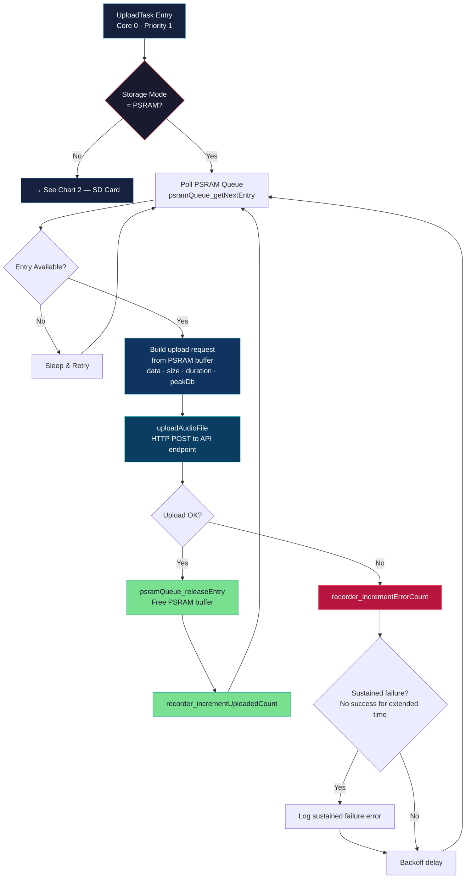
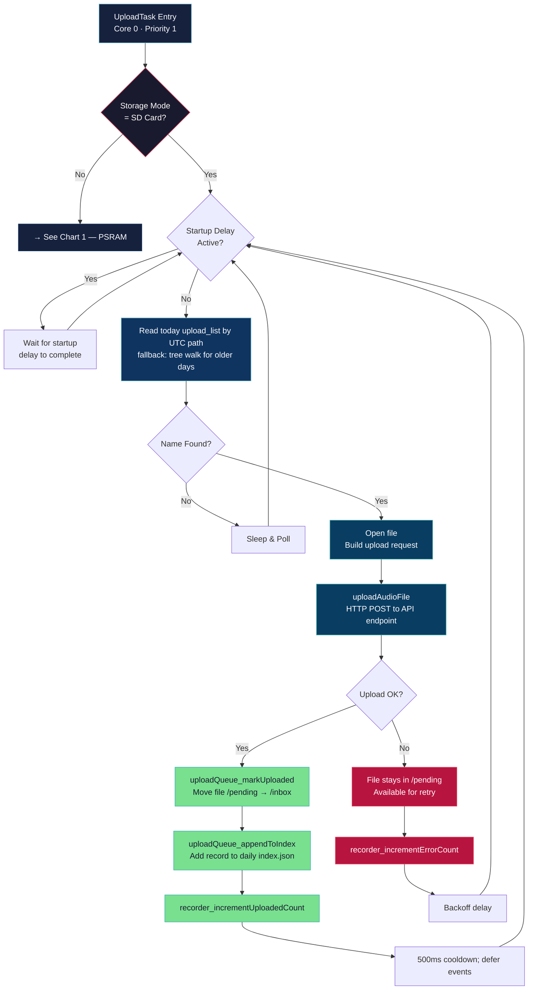
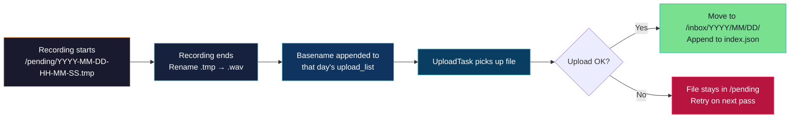

# Uploader — Upload Pipeline & Queue Management

## Overview

The UploadTask runs on **Core 0** (priority 1) and is responsible for taking completed recordings and uploading them to the cloud API via HTTP POST. It supports two storage modes with a prioritized queue system:

- **PSRAM mode** — polls the in-memory PSRAM queue, uploads, and frees the buffer
- **SD card mode** — pending names live on the card in each day's append-only `upload_list`, with progress in `upload_list.idx` (see [PENDING_UPLOAD_LIST.md](./PENDING_UPLOAD_LIST.md)); the upload task reads one name at a time. There is no in-RAM backlog of filenames.

After successful upload, SD card files are moved from `/pending` to `/inbox` and an entry is appended to the daily `index.json`.

---

## Chart 1 — Upload Pipeline (PSRAM Mode)

---

## Chart 2 — Upload Pipeline (SD Card Mode)

---

## Upload Queue Architecture

| Queue | Storage | Capacity | Source | Priority |
|-------|---------|----------|--------|----------|
| PSRAM Queue | PSRAM heap | 6 entries × ~480 KB each | `finalizeRecording()` in PSRAM mode | Only queue in PSRAM mode |
| Per-day `upload_list` | SD `/pending/YYYY/MM/DD/upload_list` | Unlimited (disk space) | `uploadList_addPending()` after finalize | Only SD pending-name source |

## File Lifecycle (SD Card Mode)

---

## Network-friendly upload behavior

Under continuous recording the ESP32 WiFi stack can run out of TCP send buffers (`tcp_write 0/4096`, then `errno 119`). Mitigations:

| Setting | Value | Purpose |
|---------|-------|---------|
| `UPLOAD_TCP_CHUNK_SIZE` | 1024 bytes | Smaller `WiFiClient::write()` calls; less pressure per syscall |
| Chunk yield | every 2 chunks | Brief `vTaskDelay(1)` so LwIP/WiFi can drain |
| `UPLOAD_INTER_FILE_COOLDOWN_MS` | 500 ms | Pause after each successful upload before the next file |
| Event drain | idle only | While `handleUploadOne()` uploaded a file, **no** event TCP — avoids competing sockets during backlog drain |
| Cloud-path WiFi reconnect | blocked while uploading | `network_reconnectWiFi()` and `cloudPathMaybeRecover()` skip if `networkHandler_isUploading()` — prevents reason-8 disconnect mid-POST (see log `06:44:14`) |

Cloud-path recovery still runs from `network_loop()` when uploads are idle; deferred reconnects wait until the current POST finishes.

---

## API Endpoints

| Endpoint | Path | Purpose |
|----------|------|---------|
| Audio Upload | `/api/v2/audio/s3` | Upload WAV file via HTTP POST |
| Events | `/api/v1/events` | Send system events (record_begin, record_end, etc.) |
| Log Upload | `/api/V1/upload/logs` | Upload log files |
| Firmware Check | `/api/v1/firmware/check` | OTA firmware update check |

Default API hosts (3 endpoints with failover):
- `3.128.235.120:7001`
- `35.85.105.6:7001`
- `52.1.103.236:7001`
