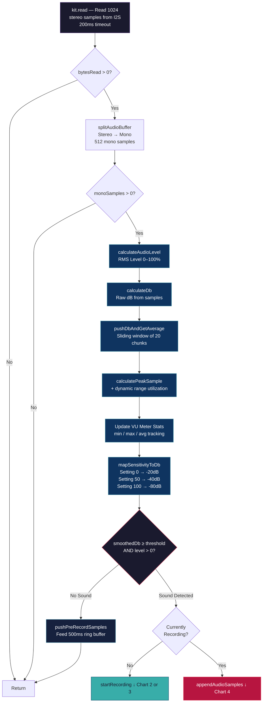
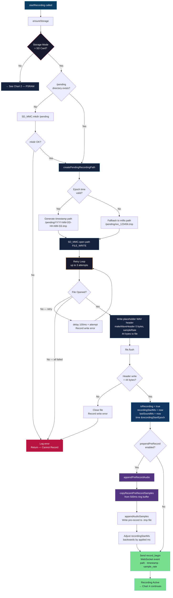
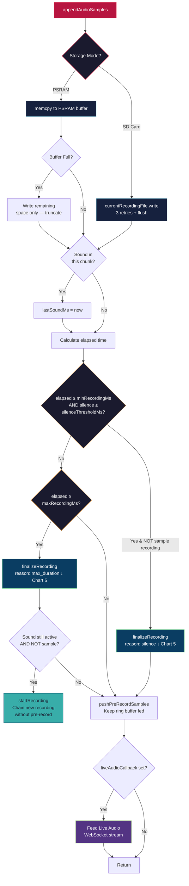
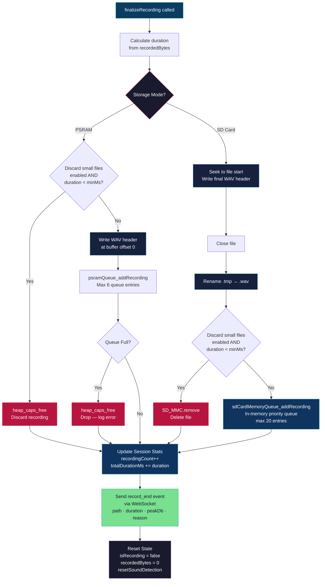
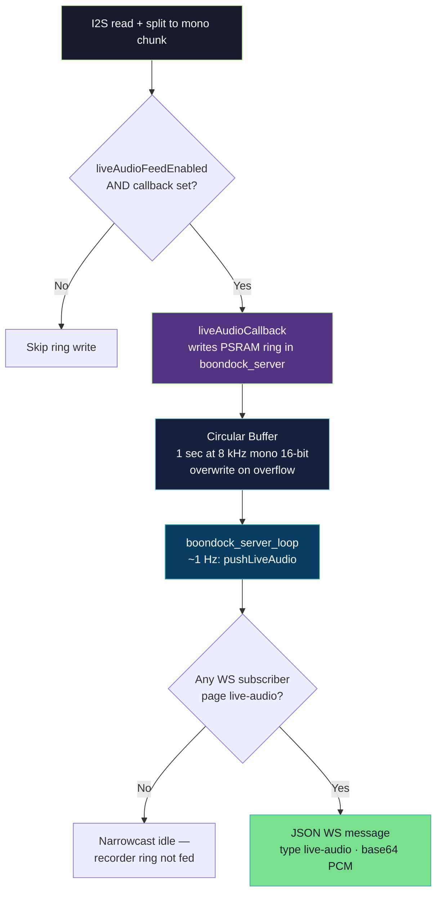

# Recorder — Audio Capture, Detection & Recording

## Overview

The recorder handles everything from reading I2S audio samples to detecting sound, managing recordings, and finalizing WAV files. It runs inside `monitorAndRecordAudio()` which is called by the RecordTask loop (see [Application.md](Application.md)).

Key mechanisms:
- **ES8388 audio codec** via AudioKit HAL (8kHz, 16-bit, stereo input split to mono)
- **Pre-record ring buffer** (500ms) so you never miss the start of sound
- **dB smoothing** (20-sample sliding window) for noise-resistant threshold detection
- **Dual storage paths** — PSRAM (in-memory, max 30s) or SD card (persistent .wav files)

**ECHO MQTT remote control:** See [MQTT_RECORD_LINE_IN.md](MQTT_RECORD_LINE_IN.md) for the `record_line_in` command (enable/disable VOX recording over MQTT).

---

## Chart 1 — Audio Capture & Sound Detection

---

## Chart 2 — Start Recording (PSRAM Mode)

```mermaid
flowchart TD
    SR0[startRecording called] --> SR1[ensureStorage]
    SR1 --> SR2{Storage Mode<br/>= PSRAM?}
    SR2 -- No --> SD_LINK[→ See Chart 3 — SD Card]

    SR2 -- Yes --> P1[Log: Starting PSRAM recording<br/>max_bytes · queue_slots]
    P1 --> P2{psramQueue<br/>_getAvailableSlots<br/>> 0?}
    P2 -- No --> P3[psramQueue_dropOldestEntry<br/>Free oldest completed recording<br/>to make room]
    P3 --> P4
    P2 -- Yes --> P4[Calculate max buffer size<br/>min of maxRecordingMs and 30s cap<br/>× sampleRate × 2 bytes]
    P4 --> P5[Cap at 480,000 bytes<br/>kPsramRecordingMaxBytes]
    P5 --> P6[heap_caps_malloc SPIRAM<br/>Allocate WAV header 44B<br/>+ audio buffer up to 480KB]
    P6 --> P7{Allocation<br/>Succeeded?}
    P7 -- No --> FAIL[Log error<br/>Return — Cannot Record]
    P7 -- Yes --> P8[psramRecordingCapacity = maxBytes<br/>psramRecordingOffset = 44<br/>Leave space for WAV header]
    P8 --> P9[currentRecordingPath = PSRAM]
    P9 --> COMMON

    COMMON[isRecording = true<br/>recordingStartMs = now<br/>lastSoundMs = now<br/>time &recordingStartEpoch] --> PR{prependPreRecord<br/>enabled?}
    PR -- Yes --> PR1[appendPreRecordAudio]
    PR1 --> PR2[copyRecentPreRecordSamples<br/>from 500ms ring buffer]
    PR2 --> PR3[appendAudioSamples<br/>Write pre-record to PSRAM buffer]
    PR3 --> PR4[Adjust recordingStartMs<br/>backwards by applied ms]
    PR4 --> EVT
    PR -- No --> EVT

    EVT[Send record_begin<br/>WebSocket event<br/>path · timestamp · sample_rate] --> DONE[Recording Active<br/>→ Chart 4 continues]

    style SR0 fill:#0a3d62,stroke:#38ada9,color:#fff
    style SR2 fill:#1a1a2e,stroke:#e94560,color:#fff
    style P3 fill:#b71540,stroke:#e94560,color:#fff
    style P6 fill:#16213e,stroke:#82ccdd,color:#fff
    style P8 fill:#16213e,stroke:#82ccdd,color:#fff
    style COMMON fill:#0f3460,stroke:#53a8b6,color:#fff
    style PR1 fill:#533483,stroke:#b8e994,color:#fff
    style PR2 fill:#533483,stroke:#b8e994,color:#fff
    style EVT fill:#78e08f,stroke:#38ada9,color:#1a1a2e
    style FAIL fill:#b71540,stroke:#e94560,color:#fff
    style SD_LINK fill:#16213e,stroke:#0f3460,color:#fff
    style DONE fill:#78e08f,stroke:#38ada9,color:#1a1a2e
```

---

## Chart 3 — Start Recording (SD Card Mode)

---

## Chart 4 — Active Recording & Stop Conditions

---

## Chart 5 — Finalize Recording

---

## Chart 6 — Live Audio Streaming

Firmware streams mic PCM over the websocket **independent of whether a WAV recording is active**. After each `kit.read` + mono split + level smoothing, **`liveAudioCallback`** may run (**not** gated on `isSound`—silence and sub-threshold audio are included). The recorder only invokes that callback while **`recorder_setLiveAudioFeedEnabled(true)`** (set by the websocket layer when **any** client is subscribed to the `live-audio` page). The lambda registered in **`boondock_server.cpp`** copies samples into a PSRAM ring; **`boondock_server_pushLiveAudio()`** (main loop timing) sends base64-encoded chunks to subscribed clients.

---

## Key Flow Summary

| Phase | Function | What Happens |
|-------|----------|-------------|
| **Read** | `kit.read()` | 1024 stereo samples read from I2S into `audioBuffer` |
| **Split** | `splitAudioBufferForRecording()` | Stereo demuxed to 512 mono samples in `recordingBuffer` |
| **Analyze** | `calculateDb()` + `pushDbAndGetAverage()` | Raw dB computed, then smoothed over 20-sample window |
| **Detect** | Threshold comparison | Smoothed dB vs `mapSensitivityToDb(threshold)` where setting 50 = -40 dB |
| **Pre-buffer** | `pushPreRecordSamples()` | 500ms ring buffer always fed so recording starts *before* sound was detected |
| **Live stream** | `liveAudioCallback` (+ `liveAudioFeedEnabled`) | Every mono chunk after analysis (silence included); ring + `pushLiveAudio` when WS clients subscribe to `live-audio` |
| **Start** | `startRecording()` | PSRAM buffer allocated or SD .tmp file opened; pre-record audio prepended |
| **Capture** | `appendAudioSamples()` | PSRAM: memcpy; SD: file write with 3 retries + flush |
| **Stop** | Silence or max duration | Silence: `minRecordingMs` elapsed + `silenceThresholdMs` of quiet; Max: `maxRecordingMs` hard cap (default 30s) |
| **Finalize** | `finalizeRecording()` | WAV header written, file renamed .tmp → .wav, queued for upload |
| **Chain** | Auto-restart on max duration | If sound still active when max reached, immediately starts a new recording (no pre-record) |
